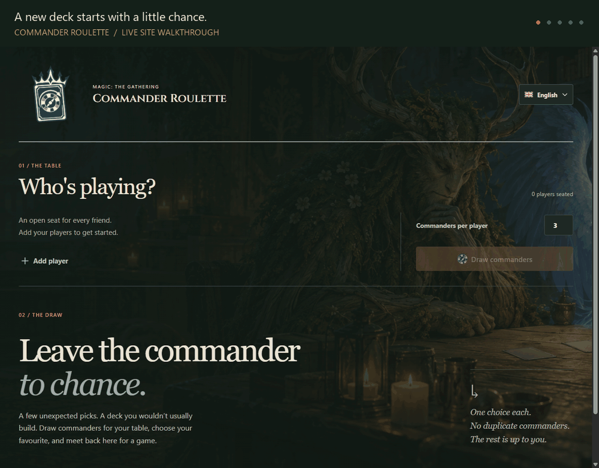

<p align="center">
  <a href="https://mtg-commander-roulette-pi.vercel.app/">
    
  </a>
</p>

<h1 align="center">MTG Commander Roulette</h1>

<p align="center">A few unexpected picks. A deck you wouldn't usually build.</p>

<p align="center">
  <a href="https://mtg-commander-roulette-pi.vercel.app/"><strong>Try MTG Commander Roulette →</strong></a>
</p>

[](https://mtg-commander-roulette-pi.vercel.app/)

*A condensed walkthrough of the live site with commander data preloaded in the browser cache. Actual commander choices are random.*

## What is it?

Commander Roulette is a small Magic: The Gathering tool for friends who want a new deckbuilding challenge. Add the players at your table, choose how many commander options each person receives, and let chance decide the starting point.

Each player picks one of their drawn commanders, builds a deck around it, and meets the others for a game. Deckbuilding and games happen outside the app.

## How to play

1. Open [the live site](https://mtg-commander-roulette-pi.vercel.app/).
2. Use **Add player** to set up your table and enter everyone's name.
3. Set **Commanders per player** and click **Draw commanders**.
4. Choose one commander from your options. Follow the card's Scryfall link or its **EDHREC** link for more information and deckbuilding ideas.
5. Use **Share table** when you are ready to publish the draw. Copy one private link per player; each player can only see, fix, and reroll their own line. A separate spectator link shows the whole table without controls.

## Features

- **Distinct options across the table:** a commander is not assigned to multiple players in the same draw.
- **Flexible table setup:** add, rename, or remove players and choose the number of options per player.
- **Individual rerolls:** redraw one player's options while keeping everyone else's choices. **Reroll all** starts a fresh draw for the whole table.
- **Late arrivals:** add a player after a draw and deal their options without redrawing the others.
- **Card languages:** English, Spanish, French, German, Italian, and Japanese. The interface itself is in English; the selector changes the card prints.
- **Double-faced cards:** use **Transform** to view the other face when available.
- **Optional collaborative tables:** publish a completed local draw only when you want to share it. Player links are private, revocable, and limited to one line; spectator links are read-only.
- **Responsive layout:** works on desktop and mobile, with light and dark themes following your system preference.

## Card data and storage

Card data and images come from [Scryfall](https://scryfall.com/) through the dedicated Commander Roulette API. The API imports Scryfall Bulk Data on demand and prepares the supported card languages; the browser never paginates through Scryfall's search API. It does not independently validate a completed deck or your group's house rules.

Commander data is cached in your browser for 24 hours per language, while API responses are also cached by Vercel's CDN. Brief network failures are retried automatically.

Local draws stay in your browser until you publish them. A published table stores player names, commander Oracle IDs, locks, and remaining jokers for up to 30 days after the last change. The organiser can revoke and regenerate player or spectator links at any time. URLs keep their access token in the hash fragment, so it is not sent to the server as part of the request URL.

Legacy `#share=…` links still open as read-only snapshots.

## Run locally

Use **Node.js 22.12 or newer**, with npm.

From the project directory:

```sh
npm ci
npm run dev
```

Open the local URL printed in the terminal, usually `http://localhost:5173`.

```sh
npm test       # Run the test suite
npm run build # Type-check and create the production build in dist/
```

Copy `.env.example` to `.env.local` and set `VITE_COMMANDER_API_URL` to the local or deployed Commander Roulette API URL. Publishing a collaborative table also needs `COMMANDER_API_URL`, `DATABASE_URL`, `ACCESS_TOKEN_SECRET`, and `CRON_SECRET` in the Vercel project environment.

## Deploy on Vercel

Import the repository into Vercel with these settings:

| Setting | Value |
| --- | --- |
| Framework preset | Vite |
| Build command | `npm run build` |
| Output directory | `dist` |
| Environment variables | `VITE_COMMANDER_API_URL`, `COMMANDER_API_URL`, `DATABASE_URL`, `ACCESS_TOKEN_SECRET`, `CRON_SECRET` |

Provision a Neon Postgres database from the Vercel Marketplace, set `DATABASE_URL`, then run `npm run db:migrate` once against that database before deploying. The root `api/` directory contains the Vercel Functions and `vercel.json` schedules the daily expiry cleanup.

## Built with

[React](https://react.dev/), [TypeScript](https://www.typescriptlang.org/), [Vite](https://vite.dev/), [Vitest](https://vitest.dev/), and [Phosphor Icons](https://phosphoricons.com/). Hosted on [Vercel](https://vercel.com/).

## Credits

Commander Roulette is unofficial fan content and is not affiliated with or endorsed by Wizards of the Coast. Magic: The Gathering, card artwork, card text, and mana symbols belong to Wizards of the Coast, LLC and their respective rights holders.

Card data and images are provided by Scryfall. Deckbuilding links point to EDHREC. Neither service is affiliated with this project.
